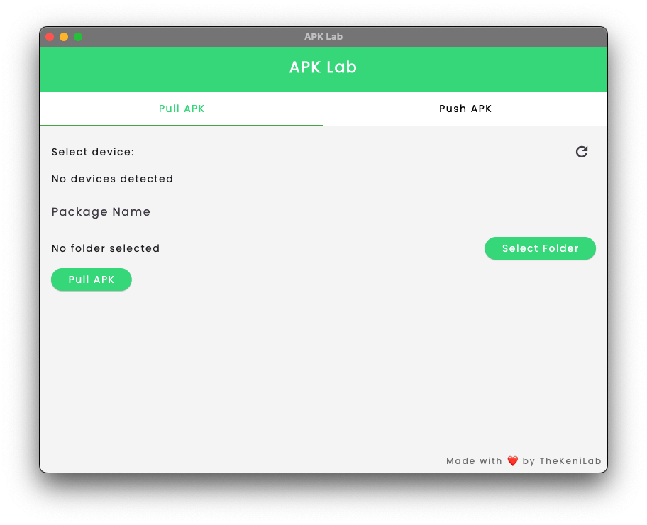
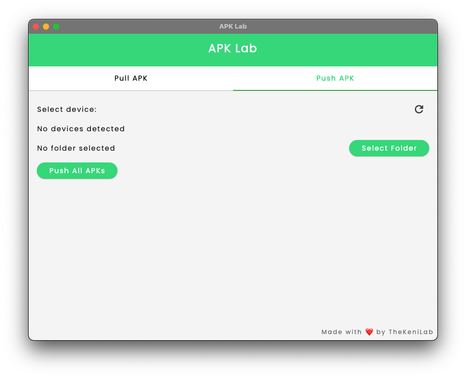

# 📦 APK Lab (Flutter macOS App)

> A simple, user-friendly macOS desktop app to **pull & push APKs** between your computer and connected Android devices, built with Flutter.

---

## ✨ Features

- ✅ Detects `adb` automatically.
- ✅ Lets you select connected devices with a dropdown & refresh button.
- ✅ Two main tabs:
    - **Pull APK** — extract installed APK(s) from a selected device.
    - **Push APK** — install one or more APKs (base + splits) on a selected device.
- ✅ Supports:
    - Selecting folder to save pulled APKs.
    - Selecting folder with `.apk` files to push.
    - Automatically installs all `.apk` splits together using `adb install-multiple`.
    - Uninstall apps by package name.
    - Export logs to text file.
    - Progress indicator while running commands.

---

## 🖼 Screenshots

| Pull APK | Push APK |
|----------|----------|
|  |  |

---

## 📥 Installation

### 🔷 Download Release

or

### 🔷 Build from Source

#### Prerequisites

- [Flutter](https://flutter.dev/docs/get-started/install) with macOS desktop enabled.
- `adb` installed on your system (`brew install android-platform-tools` recommended).

